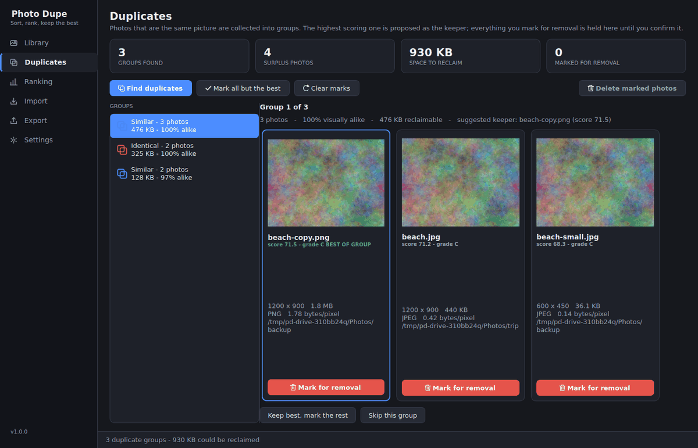
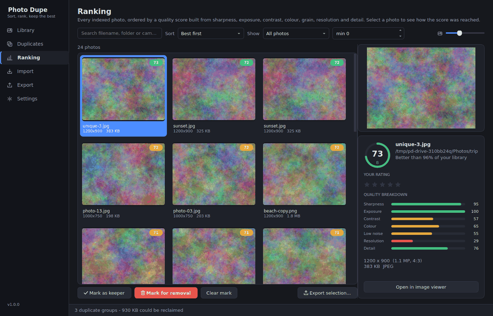
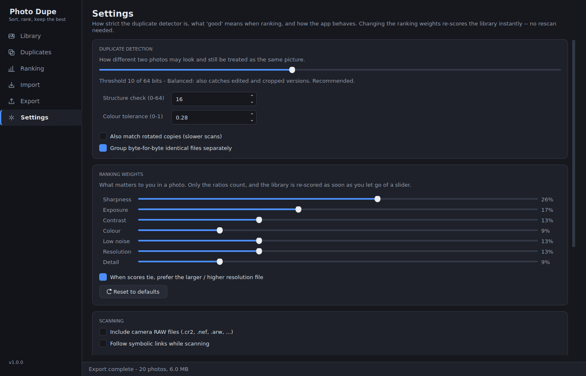

# Photo Dupe

A desktop app for Ubuntu that finds the photos you have more than one copy of,
scores every photo on technical quality, and helps you keep the best ones —
with import and export around it.

Built and tested on **Ubuntu 24.04**, Python 3.10+, PySide6 (Qt 6).



*Reviewing a duplicate group. The suggested keeper is outlined in green; nothing
is deleted until you confirm. (The sample images are synthetic test photos, so
the app can be demonstrated without shipping anyone's holiday snaps.)*

---

## What it does

**Finds duplicates that are not byte-identical.** A photo you resized, re-saved,
imported twice, or edited slightly is still the same picture. Photo Dupe
compares what the photos *look like* — not their filenames, timestamps or
checksums — so a 400 KB JPEG and the 6 MB original land in the same group.

**Ranks every photo.** Seven measurements — sharpness, exposure, contrast,
colour, grain, resolution and detail — are combined into a score out of 100.
You can see exactly which measurement produced which part of the score, and
change what the app cares about with a set of sliders.

**Recommends a keeper, then gets out of the way.** In every duplicate group the
highest scoring photo is proposed as the one to keep. Nothing is deleted until
you say so, and deletions go to the desktop trash by default.

**Imports and exports.** Pull photos off a camera or memory card with duplicates
turned away at the door; write the winners back out, ranked, renamed, resized if
you like, with a spreadsheet describing what was chosen.

---

## Install

```bash
git clone https://github.com/fsglodminer/photo-dupe.git
cd photo-dupe
./install.sh
```

The installer creates a self-contained environment under
`~/.local/share/photo-dupe`, adds a `photo-dupe` command to `~/.local/bin`, and
puts the app in your application menu. Nothing is installed system-wide except
the Qt runtime libraries from `apt`, which it will ask for your sudo password to
install.

For iPhone HEIC photos:

```bash
./install.sh --with-heic
```

To try it without installing anything:

```bash
./run.sh
```

To remove it (`--purge` also deletes the index and settings; your photos are
never touched either way):

```bash
./uninstall.sh
```

---

## Getting started

1. Open **Photo Dupe** from your application menu, or run `photo-dupe`.
2. On the **Library** page, add the folder holding your photos and press
   **Scan now**. The first scan reads every file; later scans only look at what
   changed, so re-scanning a large library takes seconds.
3. Go to **Duplicates** and press **Find duplicates**. Groups appear on the
   left, the photos in the selected group side by side on the right, with the
   suggested keeper outlined in green.
4. Mark what you do not want — one photo at a time, group by group with
   **Keep best, mark the rest**, or the whole library at once with **Mark all
   but the best** — then press **Delete marked photos**.
5. **Ranking** shows everything best-first. Select a photo to see its quality
   breakdown; select several and export just those.
6. **Export** writes photos out: the whole library, one per duplicate group, the
   top N, or everything above a score.



*Every photo scored out of 100, with the breakdown behind the number and the
photo's percentile within the library.*

### Keyboard shortcuts

| Shortcut | Action |
| --- | --- |
| `Ctrl+1` … `Ctrl+6` | Jump to a page |
| `Ctrl+R` | Scan the watched folders |
| `Ctrl+D` | Find duplicates |
| `Ctrl+Q` | Quit |

---

## How the duplicate detection works

Each photo gets three 64-bit fingerprints and a colour signature:

| Fingerprint | What it survives | What it is used for |
| --- | --- | --- |
| **pHash** (DCT) | resizing, re-compression, mild colour grading | the primary search |
| **dHash** (gradient) | brightness changes | verifying a candidate |
| **aHash** (average) | — | tie-breaking |
| Colour signature | — | rejecting same-shape/different-colour pairs |

Comparing every photo with every other one is O(n²) — 1.25 billion comparisons
for a 50,000 photo library. Instead the pHashes go into a **multi-index hash**:
each fingerprint is split into four 16-bit segments, and if two hashes differ by
at most *d* bits in total then at least one segment must differ by at most *d/4*
— there is nowhere else for the differing bits to go. Indexing each segment
separately turns the search into a handful of dictionary lookups per photo, with
no false negatives.

Candidates are then checked against the difference hash *and* the colour
signature before being accepted, because pHash alone produces occasional false
positives on flat or symmetrical images. Accepted pairs are merged with
**union-find**, so a burst of twelve near-identical frames becomes one group
rather than sixty-six pairs.

Measured on synthetic libraries at the default threshold:

| Library size | Time to group |
| --- | --- |
| 5,000 | 0.3 s |
| 20,000 | 1.9 s |
| 50,000 | 8 s |
| 100,000 | 30 s |

(A BK-tree is kept as a fallback for thresholds above 15, where the segment
arithmetic stops paying off. It is much slower — the same 20,000 photos take
about 160 s — which is why the useful thresholds are the fast ones.)

The **similarity threshold** in Settings is the number of differing bits (out of
64) two photos may have. Lower is stricter:

| Threshold | Catches |
| --- | --- |
| 0–2 | near-identical files only |
| 3–6 | re-saved and resized copies |
| **7–12** | **also edited and cropped versions — the default** |
| 13–18 | more, at the cost of some false matches |
| 19+ | expect unrelated photos to be grouped |

---

## How the ranking works

Every metric returns a value from 0 to 1, and the score is their weighted sum.
The metrics are **absolute**, not relative to your library, so adding photos
never silently re-scores the ones already there. (The Ranking page separately
shows each photo's percentile, which is the relative view.)

| Metric | What is measured | Default weight |
| --- | --- | --- |
| Sharpness | RMS Laplacian response relative to the image's own contrast | 3.0 |
| Exposure | distance from a well-balanced histogram, plus clipping | 2.0 |
| Contrast | luminance spread, with an ideal band rather than "more is better" | 1.5 |
| Low noise | finest-scale detail *relative to* surviving structure | 1.5 |
| Resolution | megapixels, log-scaled | 1.5 |
| Colour | Hasler–Süsstrunk colourfulness | 1.0 |
| Detail | entropy of the luminance histogram | 1.0 |

Two design decisions are worth knowing about:

**Sharpness saturates.** Past the point of being critically sharp, more
high-frequency energy is grain or JPEG ringing, not detail. Without a ceiling a
noisy frame out-scores the clean original.

**Noise is measured relative to structure, not absolutely.** Absolute
high-frequency energy is a bad noise score, because blurring an image lowers it
— so ranking on it hands out points for being out of focus. Dividing the finest
detail band by the edge energy that survives a 2× downscale fixes that: blur
attenuates both terms together, while sensor grain lifts only the numerator.

**A known limitation:** at the analysis resolution, heavy JPEG artefacts can read
as sharpness, so a badly compressed file may score close to its original. This
is why the "which one do I keep?" decision falls through to resolution and then
file size when scores are close — that reliably separates an original from a
re-compressed copy.

Moving the weight sliders re-scores the whole library instantly — the
measurements are stored, so only the arithmetic is redone. No rescan needed.



---

## Command line

Everything the GUI does is available headless.

```bash
photo-dupe scan ~/Pictures --remember    # index a folder and remember it
photo-dupe scan --force                  # re-analyse everything
photo-dupe dupes                         # list duplicate groups
photo-dupe dupes --delete                # keep the best of each, bin the rest
photo-dupe rank --limit 20               # best photos first
photo-dupe rank --sort date --limit 0    # everything, newest first

photo-dupe import /media/$USER/CARD --into ~/Pictures/Library --organise date
photo-dupe import /media/$USER/CARD --dry-run --skip-similar

photo-dupe export ~/Desktop/best --best-only --naming rank
photo-dupe export ~/Desktop/top50 --top 50 --max-edge 2048 --manifest json

photo-dupe stats
```

`--help` on any subcommand lists its options.

---

## Where things are kept

| Path | Contents |
| --- | --- |
| `~/.config/photo-dupe/settings.json` | your settings |
| `~/.local/share/photo-dupe/library.db` | the photo index (SQLite) |
| `~/.cache/photo-dupe/thumbnails/` | thumbnail cache |

The index is a **cache, not the source of truth** — your photos on disk are.
Deleting `library.db` loses nothing except the time it takes to scan again.

---

## Safety

- Deletions go to the desktop trash by default (Settings can change this).
- Every delete asks for confirmation and lists the files first.
- Import and export never overwrite: a name collision becomes `photo-1.jpg`.
- Import has a **Preview** button that reports exactly what it would do and
  writes nothing.
- A rescan never clears the keep/remove decisions or star ratings you have made.

---

## Supported formats

JPEG, PNG, GIF, BMP, WebP, TIFF, AVIF, PPM/PGM, TGA, ICO out of the box.
HEIC/HEIF with `pillow-heif` (`./install.sh --with-heic`). Camera RAW files
(`.cr2`, `.nef`, `.arw`, `.dng`, …) can be switched on in Settings, though how
well they read depends on your Pillow build.

---

## Development

```bash
python3 -m venv .venv
.venv/bin/pip install -r requirements-dev.txt
.venv/bin/pip install -e .
.venv/bin/python -m pytest              # 201 tests, no display needed
```

The GUI tests run against Qt's offscreen platform, so the whole suite works over
SSH and in CI.

```
photodupe/
├── config.py      settings and XDG paths
├── imaging.py     decoding, EXIF, thumbnails
├── hashing.py     perceptual hashes and colour signatures
├── quality.py     the seven metrics and the score
├── grouping.py    multi-index hash + union-find clustering
├── db.py          SQLite index
├── scanner.py     walking folders
├── library.py     the threaded scan pipeline
├── importer.py    bringing photos in
├── exporter.py    writing photos out
├── cli.py         command line interface
└── ui/            PySide6 interface (pages/, widgets, theme, workers)
```

There is no Qt in anything above `ui/`, so the analysis code is testable without
a display, and the CLI and GUI share exactly one implementation of every
operation.

---

## Licence

MIT.
